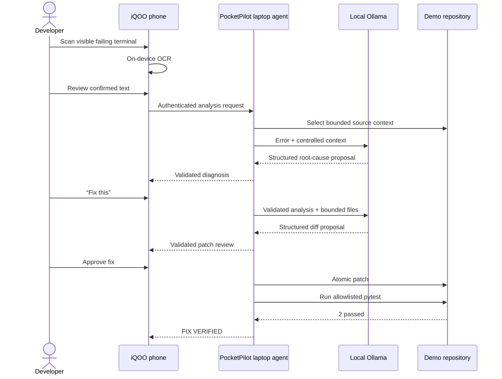

# Primary demo flow

If the real local provider does not meet the measured reliability threshold, the presentation must explicitly switch to the labeled deterministic backup; no silent fallback is allowed.
