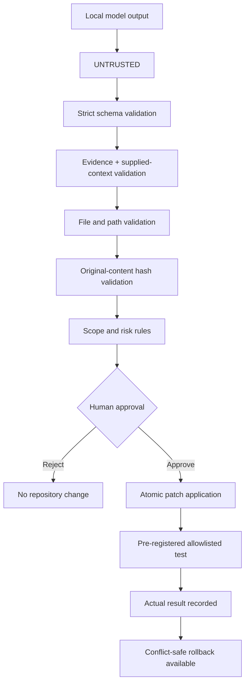

# Security boundary

The model has no filesystem or process-runner interface. Repository text, OCR text, and model output are all treated as untrusted data. Only the application can cross the approval boundary.
