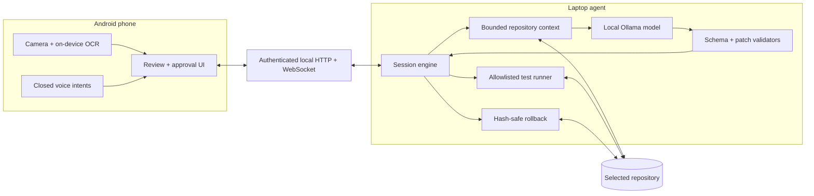

# System architecture

```mermaid
flowchart LR
    subgraph Phone[Android phone]
        Camera[Camera + on-device OCR]
        Voice[Closed voice intents]
        Review[Review + approval UI]
    end

    Bridge[Authenticated local HTTP + WebSocket]

    subgraph Laptop[Laptop agent]
        Session[Session engine]
        Context[Bounded repository context]
        AI[Local Ollama model]
        Validator[Schema + patch validators]
        Runner[Allowlisted test runner]
        Rollback[Hash-safe rollback]
    end

    Repo[(Selected repository)]

    Camera --> Review
    Voice --> Review
    Review <--> Bridge
    Bridge <--> Session
    Session --> Context
    Context --> AI
    AI --> Validator
    Validator --> Session
    Session --> Runner
    Session --> Rollback
    Context <--> Repo
    Runner <--> Repo
    Rollback <--> Repo
```

The verified transport is PocketPilot's authenticated LAN bridge. Office Kit is not shown as an implemented component because no verified developer API is available.
